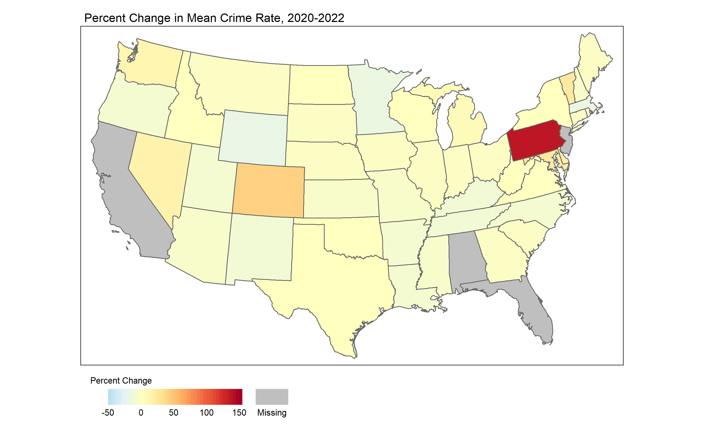
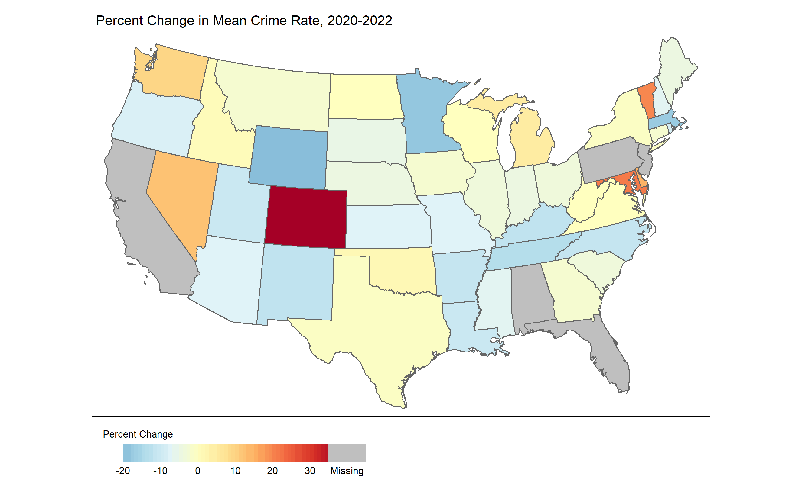
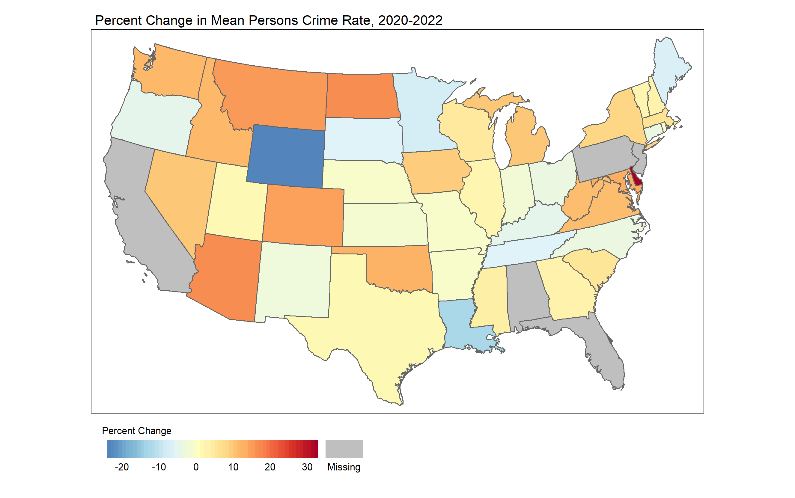
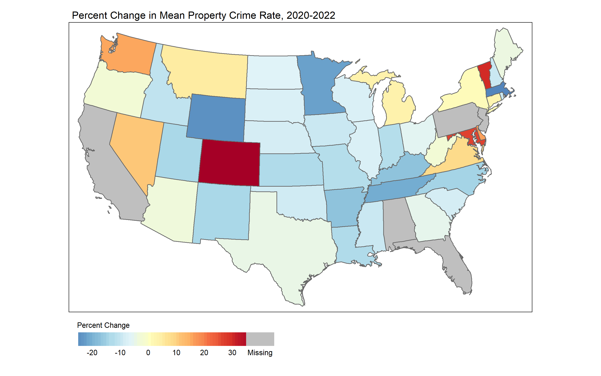
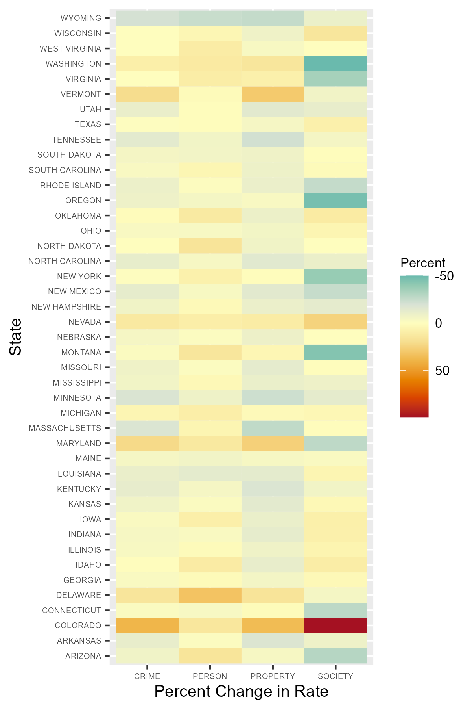
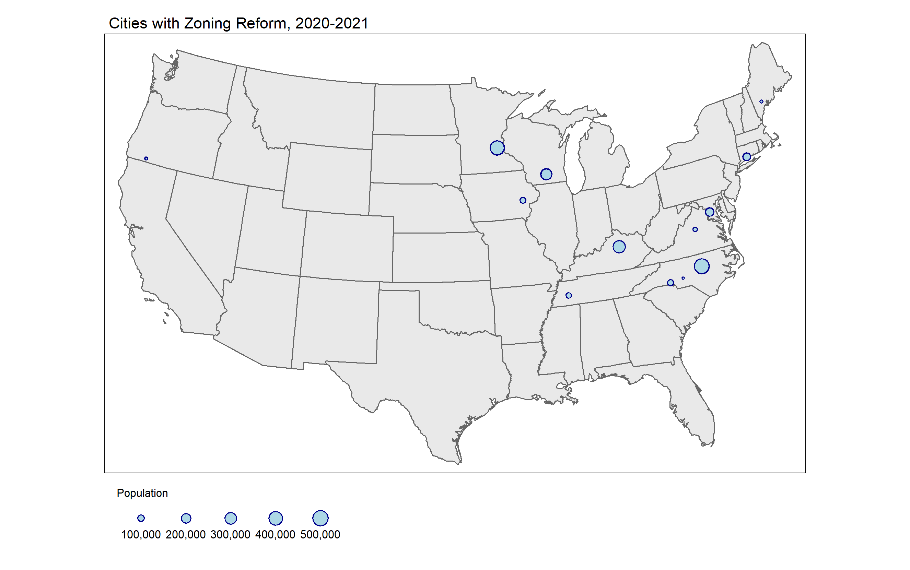
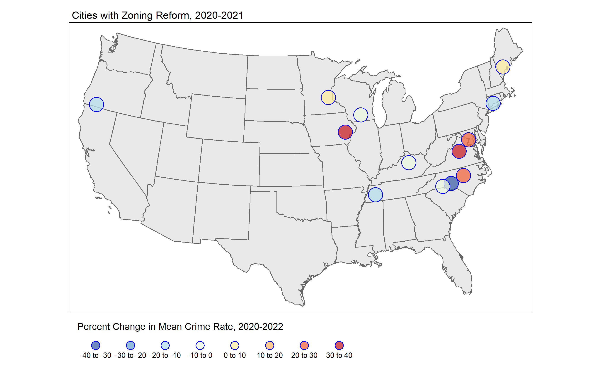
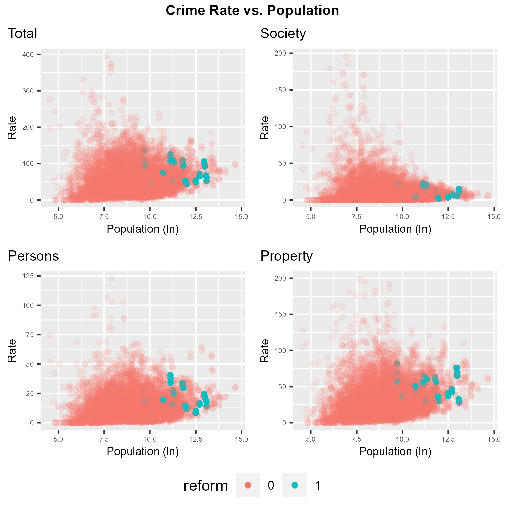
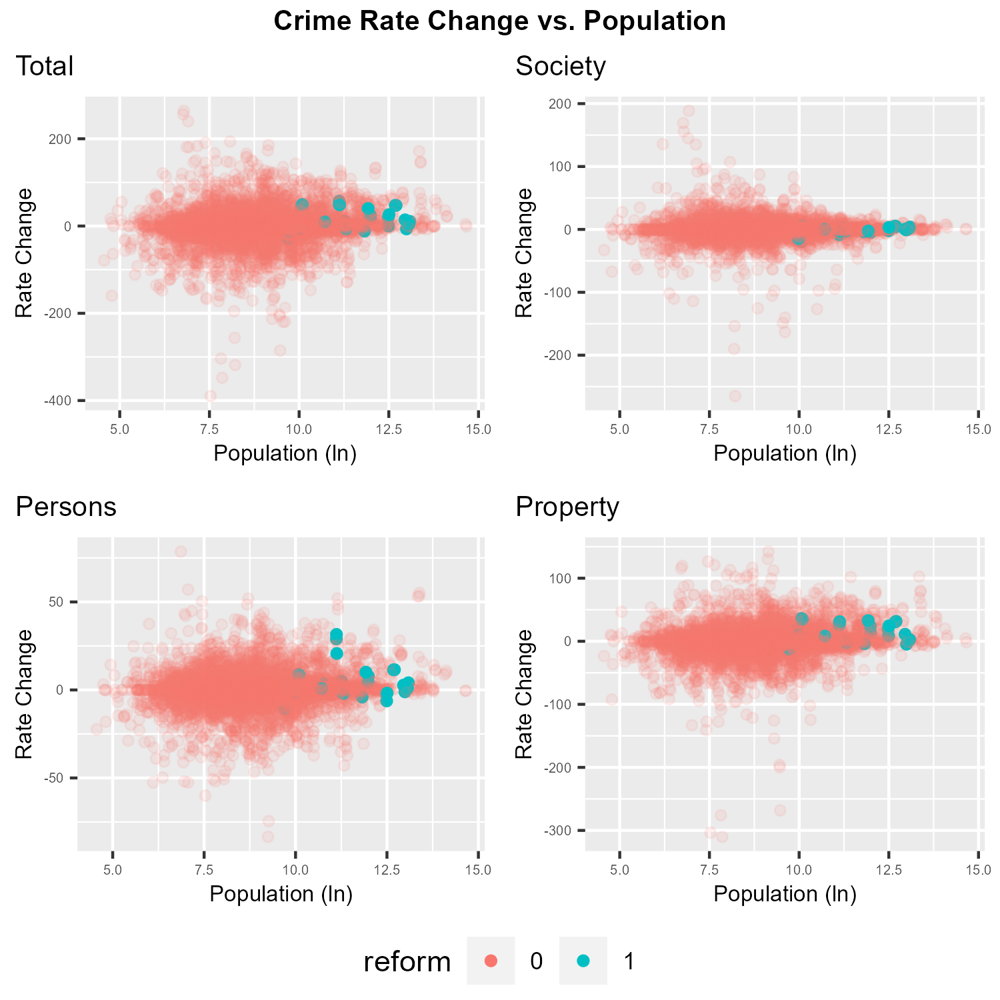

### I. Topic

\setlength\parindent{24pt}
|      Crime is a complex topic, and there is no academic (or popular) consensus on either the reasons for criminal behavior or the appropriate interventions to curtail such behavior. One theoretical intervention is reducing crime via changing the “built environment”—incorporating a spatial element to crime. This broadly ranges from land policy (zoning) to more targeted planning and landscaping interventions that focus on surveillance, access control, and target hardening (see Carter et al, 2003 and Katyal, 2002). The latter has a long history: in 1285, King Edward I decreed that bushes should be removed along highways to deter robbery (Anderson et al., 2013). Controlling crime via the built environment is an attractive policy, as a zoning change might be more efficient (or more politically palatable) than throwing more resources into enforcement and punishment. 

Theoretically, exclusionary zoning practices can help create concentrations of poverty, which could create an environment where crime is more likely. The actual academic literature on the interaction between land policy and crime do find some associations (generally surrounding the debate over the merits of mixed-use residential zoning), but there are few empirical studies (Anderson et al. blame this on a lack of data). One of the more influential non-empirical works is Jane Jacobs’ 1961 book *The Death and Life of Great American Cities*, which advocated for including commercial businesses in residential areas to reduce crime. Empirical investigations produced mixed results. Anderson et al.’s (2013) study of Los Angeles finds that commercial-only zoned areas are associated with higher crime rates, and that zoning changes that including residential parcels in prior commercial-zoned areas is associated with a reduction in crime. Browning et al. (2010) finds a curvilinear association between density – both commercial and residential – and assault and homicide. 
  
The current housing crisis has caused many cities, and even states, to either consider or enact zoning reform. These reforms (such as the 2023 state-wide reforms in Montana) often effectively eliminate single-family residential zoning by allowing multi-family development (ranging from ‘granny suites’ to triplexes) in what was formally single-family residential neighborhoods. This push is also coming from the White House; the Biden infrastructure bill includes incentives for municipal zoning reform. Are these zoning changes associated with any changes in crime, at either the state or individual municipal level?

### II. Data Sources and Notes on Data Limitations

\setlength\parindent{24pt}
|      Our primary data comes from two sources: the FBI and the University of California, Berkely. We use the FBI’s crime data to observe crime at a state and city level for the years 2020-2022. This dataset has variables on population, total crime, and a further breakdown of types of crime (generally sorted into personal, social, and property). We then merge the University of California, Berkeley’s data on municipal-level zoning reform for the year 2021 onto this crime dataset. We also used secondary data sources to merge on state-wide zoning changes (Meyershohn).  Unemployment data on a state-wide level was provided by the United States Department of Agriculture.

Due to data limitations from the FBI dataset, we are restricted to the years 2020 to 2022. Furthermore, the Covid-19 pandemic deeply impacted the reporting at a state-wide level. For example, California does not have consistent data from 2020-2022. None of the cities in California report crime statistics for 2020. If we had additional years of crime data before the Covid-19 disruptions, we might have more options for dealing with the missing data (i.e. able to impute these missing values) . However, since our dataset is so limited, we had to exclude cities that had incomplete reporting data. After we filtered for having crime statistics in all three years, we are left with 44 states. We note that the distribution of cities within these states is not consistent. Some states, such as Michigan, are very well documented; while others, like Illinois and Pennsylvania have one and two reporting cities, respectively. Future research might look for more data, in order to better capture the prior trends, as well as look at the long-term impact of zoning changes. 

Further, the crime statistics used are on a agency wide scale;  they are notably not using the more widely used FIPS code system.  This makes it difficult to append additional datasets for use as control data, since many datasets use FIPS codes, and are typically not on a city to city basis.  Additionally, since housing reform happened so recently, data for certain varibles which would have been useful as control variables, such as poverty rates and educational attainment, are simply not available.  The econometric analysis will therefore utilize state and year fixed effects to control for geographic variation.

### III. Data Cleaning

\setlength\parindent{24pt}
|      The data cleaning processes consisted of merging the three years of FBI data and converting it into tidy format.  Of particular note is the FBI statistics for the year 2022, which was formatted slightly differently from the 2021 and 2020 data sets. All the information was in the right place, so to speak, but there were unseen differences between the column names of the datasets, and some of the labels were a row above their location in the other datasets, which created a small challenge when merging.  This was resolved by manually entering the offending names to the correct location and then setting the column names of the 2022 dataset equal to the column names of the larger 2021-2020 dataset, and then merging.

We determined which cities had data for all three years of our event study and filtering for only those cities. We then merged on the zoning data, which we had cleaned. Due to the comparatively low number of cities who passed zoning reform in 2021, we were able to visually inspect the University of California, Berkeley's summaries to ensure that these laws involved the loosening of zoning - not increasing zoning restrictions. This merged file comprises our master dataset. Then, we merged on data on state-wide zoning changes to our master dataset. Only Oregon and Maine passed state-wide zoning reforms during our limited time span: Oregon in 2021 and Maine in 2022. We recognize that, due to data limitations, we cannot form any conclusions about the impact of this reform in these states.  
  
### IV. Data Transformations

\setlength\parindent{24pt}
|      We created a log transformed variable for the population per city.  This was done to avoid heavy skew in the case, as the range of populations per city in the United States can vary from the hundreds to the millions and, naturally, have varying numbers of criminal citations.  To avoid problems in interpreting the data visually, we created an additional variable which log-transformed population.  It is easier to interpret crime per capita rather than total numbers of citations in a city, so we created additional variables which calculated the total, property, personal and societal crime per capita, as well as multiplying these values by 1,000 to report the crime rate per 1,000 people. Some of the municipalities in our dataset have very low populations, so there are some extreme outliers for these calculations.  

We also created variables which record the average total crime rate for each agency and state. For the state-level variables, we averaged the crime rate (broken up into total crime, crimes against society, crimes against persons, and crimes against property) across the cities in that state. This was done so they may be used during econometric analysis as dependent variables, as well as for the graphics.  The cities enacting zoning reforms may be experiencing more crime than areas which are not receiving reforms, and including the average crime rate for each agency would control for differences in preexisting crime rates.  Additionally, variables which recorded the average crime rate for each sub-categories defined by the FBI (crime against persons, society and property) were similarly generated.  

We created additional dummy variables which reported whether the city in question enacted a zoning reform and whether a state in question had zoning reform in that year as well.  
	
### V. Plots and Remarks

The following map shows the percent change in mean total crime rate for the cities in all states (that we have data on) for 2020-2022. For ease of visibility, this is aggregated up to the state level. Note that Pennsylvania is a clear outlier. Given the above-noted issues with our data due to Covid-19 reporting issues, our following maps remove Pennsylvania for ease of visually differentiating crime rate variation. Maps that include Pennsylvania are included in the Plots sub-folder on Github.

The map below shows the percent change in mean crime rate but removes Pennsylvania. 

The following series of maps show the percent change in mean crime rates for crimes against persons and property. Note that all remove Pennsylvania for ease of visual variation.

The following graphic reports the information shown in the above maps as a heatmap. Across the board, there was a slight increase in crime rates from 2020-2023. There are some outliers (most notably Pennsylvania), which we attribute to either disruptions in data-collection accuracy due to Covid-19 or the over-representation of low-population cities in certain states, which could create big swings in crime rates per 1,000 people.

The cities that enacted zoning reform are concentrated in the Midwest and Atlantic regions. The map bellow shows these cities and their populations. The cities that enacted zoning reform tend to skew to higher populations. 

The map below shows the percent change in mean total crime rate for these cities. We see a fairly even split between cities that saw increasing total crime rates and cities that saw decreasing total crime rates. 

The below four scatter-plots in Figure 1 shows the crime rate (total, society, persons, and property) versus log-transformed population for all cities in our dataset. Cities with zoning reform are shown in blue. For visibility purposes, extreme values are excluded from these figures. As noted prior in this report, cities that enacted zoning reform tend to skew to higher populations. This is not surprising, as population growth/high population might create housing demand that is met by a policy decision such as zoning reform. 

In Figure 2, the four scatterplots shows the percentage change in crime rate (total, society, persons, and property) versus log-transformed population for all cities in our dataset. For visibility purposes, extreme values are again excluded from these figures. 

As is clearly shown in the above graphics, our data is noisy, and there are also quite a bit of extreme observations. Our data includes cities with quite low populations, and these cities can have large swings in crime rate (especially when crime rate is conventionally reported as per 1,000 people). The majority of the data is clustered around 0%, but the presence of these extreme observations make visualization tricky. For the purposes of some of our graphics we have elected to not show these outliers. 

### V.I. Econometric Analysis
\setlength\parindent{24pt}
|      The time frame that zoning reform exists in is far too recent to make any inferences about the effect of zoning reform on crime.  However, we can describe the cities which have passed zoning reform and determine if they have a higher crime rate relative to cities which have not passed zoning reform.  This would be important to policy makers, because if zoning reform is associated with higher crime rates, it would follow that cities with high crime rates may also have more movements to enact zoning reform. It would also be useful to future researchers studying the effects of changes in zoning laws, as findings of significantly different crime rates and changes in crime rates would impact the efficiency of their analysis models.

The regression formulas use 4 different dependent variables: total crime rate, crime rate against property, crime rate against persons and crime rate against society. These values are reported as the number of crimes committed per 1,000 people in the agency.  The dependent variables are subdivided in this manner to study the effect of zoning laws on the kinds of crimes which are committed.  The primary independent variable in question is reform, which is a dummy variable which indicates the presence of housing reform in that state or city.  The control variables used are the unemployment rate, the mean crime rate for each agency, which controls for a preexisting level of crime in each city, state fixed effects, and year fixed effects.  An identical set of regression formulas was run using the change in crime rates as the dependent variables as well.

Crime Rate = Beta0 + Beta1(Reform) + Beta2(Unemployment Rate) + Beta3(City Mean Crime Rate) + Alpha(State Fixed Effects) + Gamma(Year Fixed Effects) + E

As the regressions show, there is no significant relationship between crime rates and zoning reform.  However, there is a significant relationship at the 95% confidence level between zoning reform and changes in property crime rates and the crimes against persons rate.  What this implies is the impetus for zoning reform may not be an existing level of crime, but cities where the crime rates for property crimes and crimes against persons increase sharply.  Movements for housing reform may therefore be associated with shocks in the crime rate.

A notable issue with the model as shown is that the unemployment rate for each state decreases the estimated crime rate for each city.  Logically, a higher unemployment rate should be associated with a higher crime rate, so a negative coefficient for unemployment rate may indicate issues between it and the mean crime rate.  Perhaps the unemployment and mean crime rate are heavily correlated with each other, which leads to the confusing value for unemployment rate.

### V.II. Conclusions

\setlength\parindent{24pt}
|      Although we noted several caveats with our model, our econometric analysis produced interesting results: the significant relationship between zoning reform and crime against property and persons. As noted throught this write-up, there are significant issues with the simultaneous lack and abundance of data. We have few years of crime data, and we have magnitudes more data for cities that did not enact zoning reform. This is also a recent policy change, and the effects of zoning change are most likely lagged due to the time constraints on building. While this is an interesting area of analysis, our work here looks at very preliminary data. Future work will have the luxury of more extensive data.

We note some final thoughts on limitations for future work. The issue of the Covid-19 year will still have significant impacts. The lack of consistently reported crime data during those years do present some serious difficulties. 

Future studies when data of the effects of zoning reform is made available will be able to note that the environment of the different cities are defined by a difference in the change of crime rates.  This may make future studies which are relying on a difference in difference or event time model problematic, since the assumption of parallel preexisting trends may not hold up in these conditions. Researchers following up on this subject would do well to account for the different trends to ensure the accuracy of their findings.

### V.III. References

Anderson, James M., et al. “Reducing Crime by Shaping the Built Environment with Zoning: An Empirical Study of Los Angeles.” University of Pennsylvania Law Review, vol. 161, pp. 700-756. 

Browning, Christopher R., et al. "Commercial Density, Residential Concentration, and Crime: Land Use Patterns and Violence in Neighborhood Context." Journal of Research in Crime and Delinquency, vol. 47, no. 3, August 2010, pp. 329-357.

Carter, Sherry P., et al. “Zoning out Crime and Improving Community Health in Sarasota, Florida: ‘Crime Prevention Through Environmental Design’.” American Journal of Public Health, vol. 93, no. 9, September 2003, pp. 1442-1445.

Crime Data Explorer. “NIBRS table: State Tables, Offenses by Agency.” Federal Bureau of Investigations. 

Katyal, Neal K. “Architecture as Crime Control.” The Yale Law Journal, vol. 111, pp. 1039 -1139. 

Meyersohn, Nathaniel. “The Invisible Laws that Lead to America’s Housing Crisis.” CNN Business. August 5, 2023. Available from: https://www.cnn.com/2023/08/05/business/single-family-zoning-laws/index.html.

Othering & Belonging Institute. “Zoning Reform Tracker.” University of California, Berkely. Available from: https://belonging.berkeley.edu/zoning-reform-tracker.

Hlavac, Marek (2022). stargazer: Well-Formatted Regression and Summary Statistics Tables. R package version 5.2.3. https://CRAN.R-project.org/package=stargazer

United States Department of Agriculture. (n.d.). County-level data sets. USDA ERS - County-level Data Sets. https://www.ers.usda.gov/data-products/county-level-data-sets/ 
