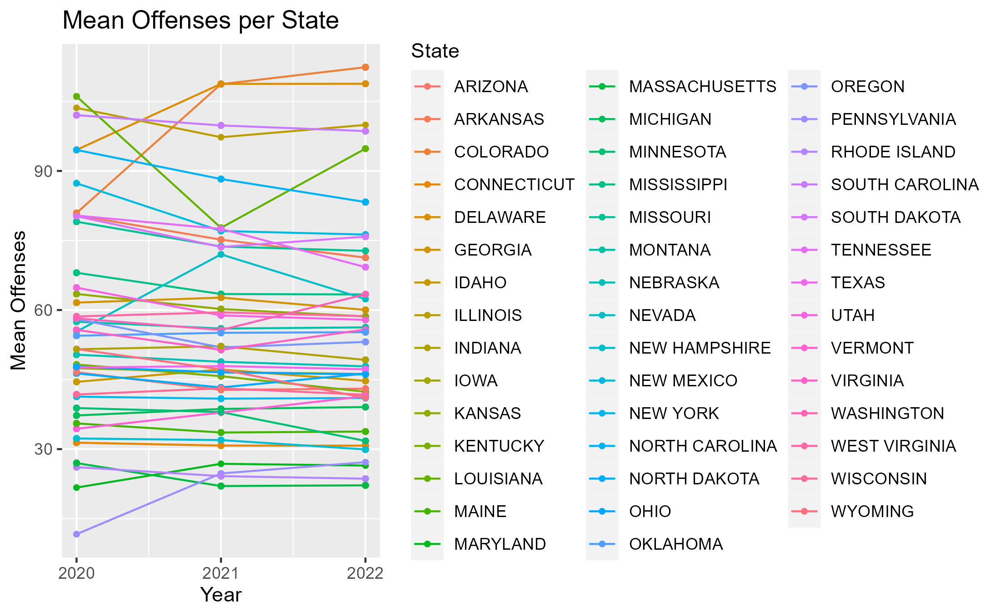
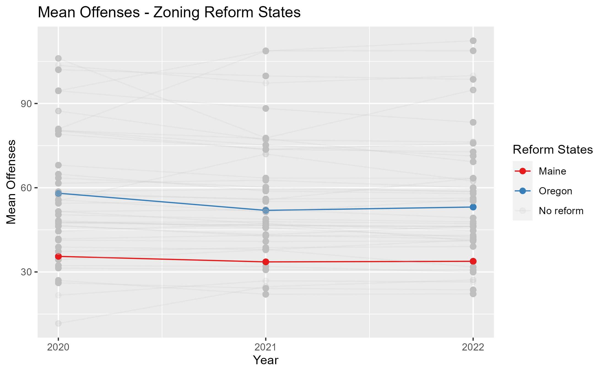
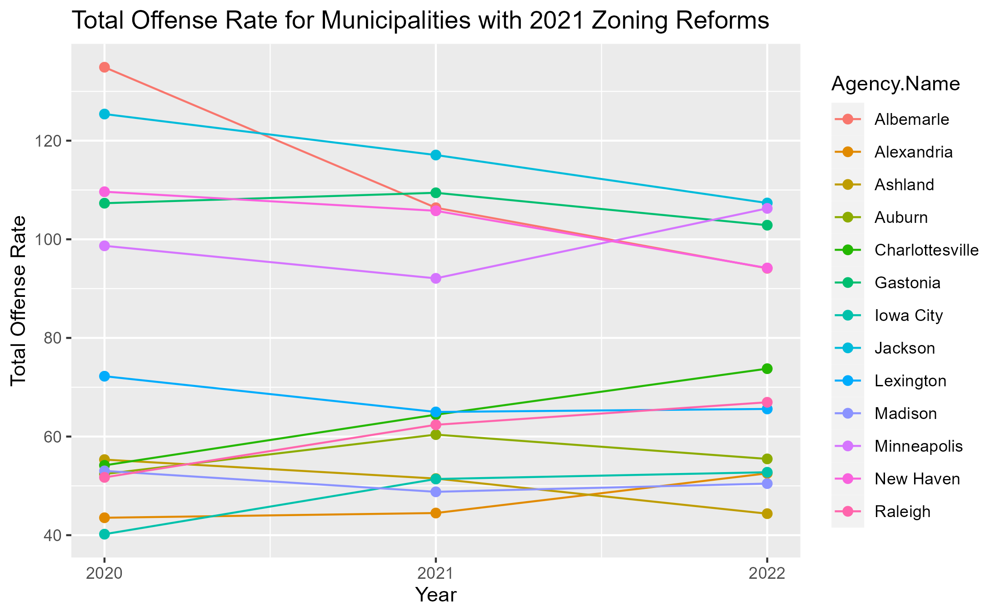
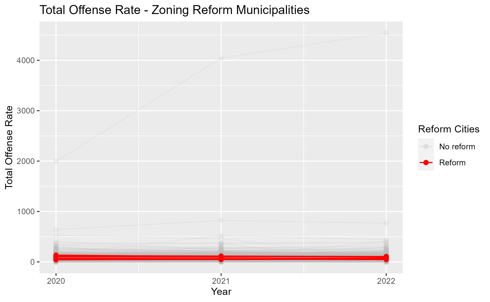
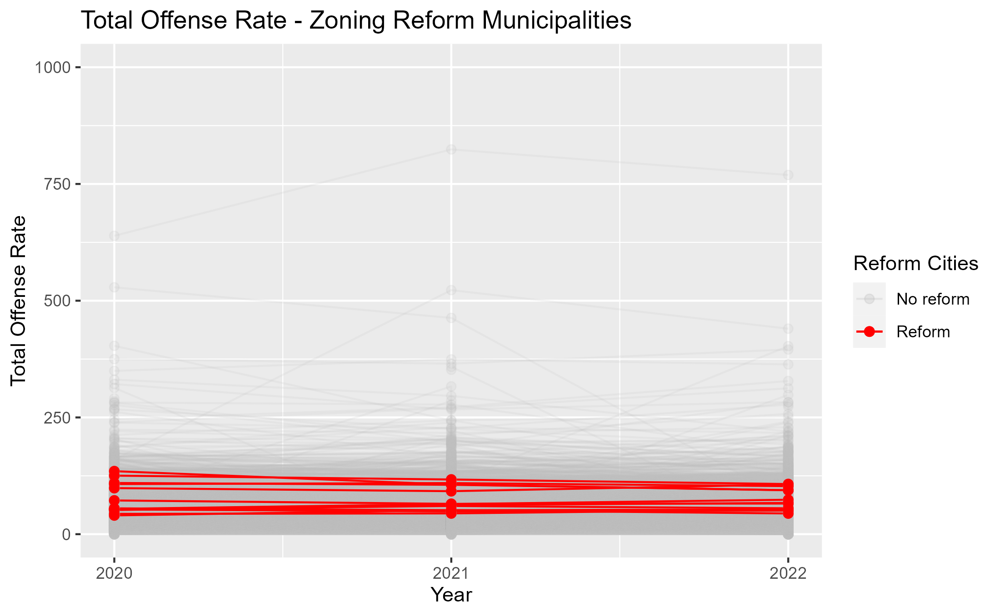

### I. (Revised) Topics

\setlength\parindent{24pt}
|      Crime is a complex topic, and there is no academic (or popular) consensus on either the reasons for criminal behavior or the appropriate interventions to curtail such behavior. One theoretical intervention is reducing crime via changing the “built environment”—incorporating a spatial element to crime. This broadly ranges from land policy (zoning) to more targeted planning and landscaping interventions that focus on surveillance, access control, and target hardening (see Carter et al, 2003 and Katyal, 2002). The latter has a long history: in 1285, King Edward I decreed that bushes should be removed along highways to deter robbery (Anderson et al., 2013). Controlling crime via the built environment is an attractive policy, as a zoning change might be more efficient (or more politically palatable) than throwing more resources into enforcement and punishment. 

Theoretically, exclusionary zoning practices can help create concentrations of poverty, which could create an environment where crime is more likely. The actual academic literature on the interaction between land policy and crime do find some associations (generally surrounding the debate over the merits of mixed-use residential zoning), but there are few empirical studies (Anderson et al. blame this on a lack of data). One of the more influential non-empirical works is Jane Jacobs’ 1961 book *The Death and Life of Great American Cities*, which advocated for including commercial businesses in residential areas to reduce crime. Empirical investigations produced mixed results. Anderson et al.’s (2013) study of Los Angeles finds that commercial-only zoned areas are associated with higher crime rates, and that zoning changes that including residential parcels in prior commercial-zoned areas is associated with a reduction in crime. Browning et al. (2010) finds a curvilinear association between density – both commercial and residential – and assault and homicide. 
  
The current housing crisis has caused many cities, and even states, to either consider or enact zoning reform. These reforms (such as the 2023 state-wide reforms in Montana) often effectively eliminate single-family residential zoning by allowing multi-family development (ranging from ‘granny suites’ to triplexes) in what was formally single-family residential neighborhoods. This push is also coming from the White House; the Biden infrastructure bill includes incentives for municipal zoning reform. Are these zoning changes associated with any changes in crime, at either the state or individual municipal level?

### II. Data Sources and Notes on Data Limitations

\setlength\parindent{24pt}
|      Our primary data comes from two sources: the FBI and the University of California, Berkely. We use the FBI’s crime data to observe crime at a state and city level for the years 2020-2022. This dataset has variables on population, total crime, and a further breakdown of types of crime (generally sorted into personal, social, and property). We then merge the University of California, Berkeley’s data on municipal-level zoning reform for the year 2021 onto this crime dataset. We also used secondary data sources to merge on state-wide zoning changes (Meyershohn). 

Due to data limitations from the FBI dataset, we are restricted to the years 2020 to 2022. Furthermore, the Covid-19 pandemic deeply impacted the reporting at a state-wide level. For example, California does not have consistent data from 2020-2022. None of the cities in California report crime statistics for 2020. If we had additional years of crime data before the Covid-19 disruptions, we might have had more options for dealing with the missing data (we might have been able to impute these missing values) . However, since our dataset is so limited, we had to exclude cities that had incomplete reporting data. After we filtered for having crime statistics in all three years, we are left with 44 states. We note that the distribution of cities within these states is not consistent. Some states, such as Michigan, are very well documented; while others, like Illinois and Pennsylvania have one and two reporting cities, respectively. Future research might look for more data, in order to better capture the prior trends, as well as look at the long-term impact of zoning changes. 

### III. Data Cleaning

\setlength\parindent{24pt}
|      The data cleaning processes consisted of merging the three years of FBI data and converting it into tidy format.  Of particular note is the FBI statistics for the year 2022, which was formatted slightly differently from the 2021 and 2020 data sets.  All the information was in the right place, so to speak, but there were unseen differences between the column names of the datasets, and some of the labels were a row above their location in the other datasets, which created a small challenge when merging.  This was resolved by manually entering the offending names to the correct location and then setting the column names of the 2022 dataset equal to the column names of the larger 2021-2020 dataset, and then merging.

We then determined which cities had data for all three years of our event study and filtering for only those cities. We then merged on the zoning data, which we had cleaned. Due to the comparatively low number of cities who passed zoning reform in 2021, we were able to visually inspect the University of California, Berkeley's summaries to ensure that these laws involved the loosening of zoning - not increasing zoning restrictions. This merged file comprises our master dataset. Then, we merged on data on state-wide zoning changes to our master dataset. Of note, only Oregon and Maine passed state-wide zoning reforms during our limited time span: Oregon in 2021 and Maine in 2022. We recognize that, without 2023 data, we cannot really form any conclusions about the impact of this reform in Maine. 
  
### IV. Data Transformations

\setlength\parindent{24pt}
|      We also created a log transformed variable for the population per city.  This was done to avoid heavy skew in the case, as the range of populations per city in the United States can vary from the hundreds to the millions and, naturally, have varying numbers of criminal citations.  To avoid problems in interpreting the data visually, an additional variable which log-transformed population was created.  Additionally, it was determined that it might be helpful to interpret crime per capita rather than total numbers of citations in a city, so additional variables were created which calculated the total, property, personal and societal crime per capita, as well as multiplying these values by 1,000 to report the crime rate per 1,000 people.  
  
Additional dummy variables were created which reported whether the city in question had zoning reform in 2021, and whether a state in question had zoning reform in that year as well.  The average amount of crime across all cities in a state was also calculated and reported in a separate variable called “meanstatecrime”, and the average amount of crime for cities which had a zoning reform versus cities which did not have a zoning reform and reported that as total crime rate.
	
### V. Preliminary Plots and Remarks

The following plot charts the mean total offenses per all states in our final dataset for 2020-2022. 

Then, we highlight the two states (noting prior qualification about Maine) that enacted state-wide zoning reform in 2022. 

We replicate the same plots for the municipalities that enacted zoning reforms in 2021, looking at their total offense rates.

Interestingly, there seems to be a split within this group: municipalities with high and low rates. Generally, there appears to be a downwards relationship between year and offense rate in the high rate group, and an upwards relationship in the low rate group.

The scale in the prior plot is through off by some extreme rates (coming from small cities, where the population is low). So, the following plot puts in place scale limits - just so we can see the reform cities trends.

The above plots show an interesting split within the municipalities that enacted zoning reform. There are significant issues with the simultaneous lack and abundance of data: we have few years of crime data, and we have magnitudes more data for cities that did not enact zoning reform. We might narrow the focus down to comparing reform/non-reform cities that are geographically close to one another (identified via finding the minimal distance between spatial points), or, more generally, comparing the municipalities to their respective state trends. Within this more narrow focus, we will also want to look at the breakdown between offense types (social, property, persons) to see if there are any relationships or trends there.

### VI. References

Anderson, James M., et al. “Reducing Crime by Shaping the Built Environment with Zoning: An Empirical Study of Los Angeles.” University of Pennsylvania Law Review, vol. 161, pp. 700-756. 

Browning, Christopher R., et al. "Commercial Density, Residential Concentration, and Crime: Land Use Patterns and Violence in Neighborhood Context." Journal of Research in Crime and Delinquency, vol. 47, no. 3, August 2010, pp. 329-357.

Carter, Sherry P., et al. “Zoning out Crime and Improving Community Health in Sarasota, Florida: ‘Crime Prevention Through Environmental Design’.” American Journal of Public Health, vol. 93, no. 9, September 2003, pp. 1442-1445.

Crime Data Explorer. “NIBRS table: State Tables, Offenses by Agency.” Federal Bureau of Investigations. 

Katyal, Neal K. “Architecture as Crime Control.” The Yale Law Journal, vol. 111, pp. 1039 -1139. 

Meyersohn, Nathaniel. “The Invisible Laws that Lead to America’s Housing Crisis.” CNN Business. August 5, 2023. Available from: https://www.cnn.com/2023/08/05/business/single-family-zoning-laws/index.html.

Othering & Belonging Institute. “Zoning Reform Tracker.” University of California, Berkely. Available from: https://belonging.berkeley.edu/zoning-reform-tracker.
